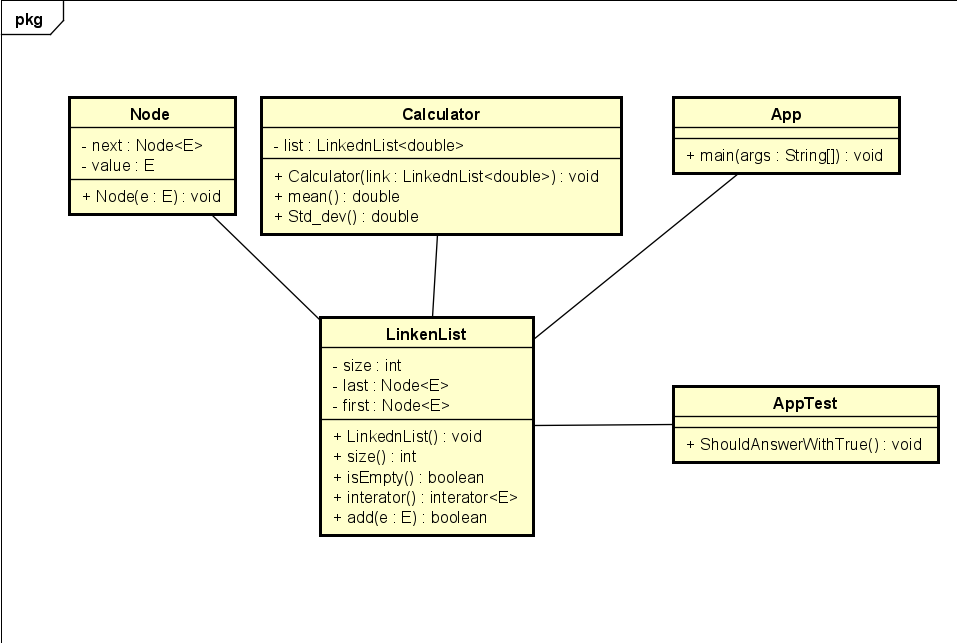

# OODesign
## Laura Daniela Pachon Cuan 
## Software Architecture (ARSW 2021-i)

June 04 - 2021

## Class diagram 

The appTest class shows us the numbers with which we carry out the tests.
The app class helps us to read the numbers that we have in the tests correctly 
where it also implements the code of the program from the previous job where 
the lines of the file are read in this case a list.  Calculator this class helps
us to perform the mathematical operations that we are asked in our exercise where
the mean and standard deviation can be calculated.  The Node class handles each
position in the list.  The general class and in the center of the other classes where
the list as such can be evidenced.

